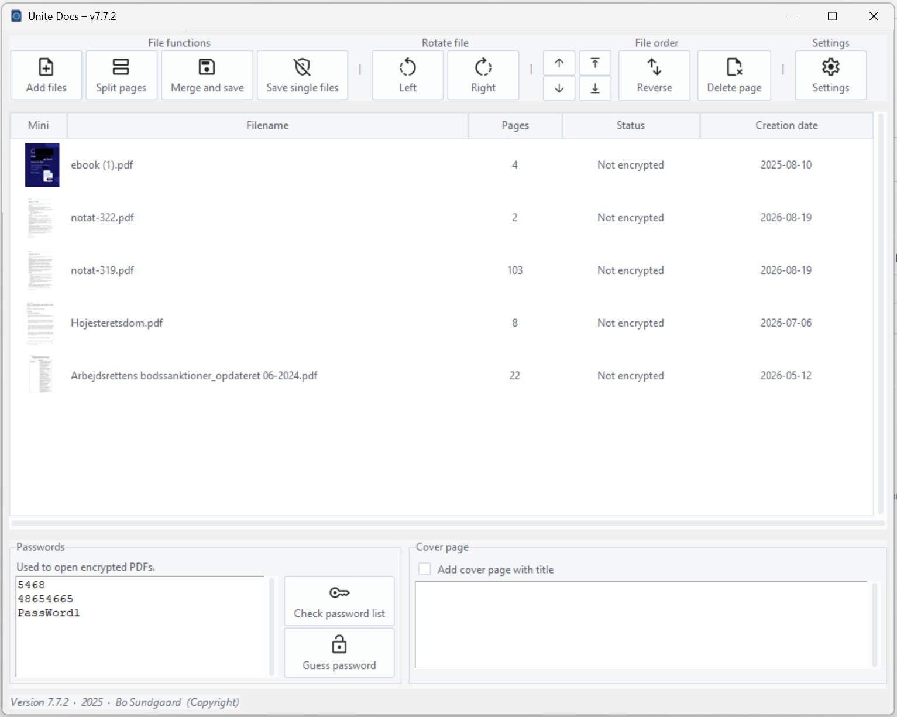
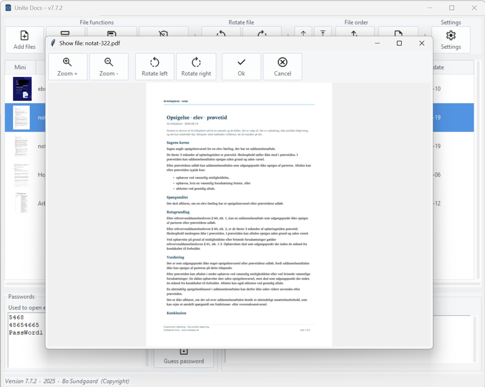

<div align="center">

# 📄 Unite Docs

### The free, private, offline PDF merger & manager for Windows

**Merge, reorder, rotate, crop and unlock PDFs — even password‑protected ones — without ever uploading a single file to the cloud.**

[](https://github.com/bosund/UniteDocsClientPublic)
[](CHANGELOG.md)
[](https://www.python.org/)
[](#-multi-language-support)
[](#-your-files-never-leave-your-pc)
[](#-contributing--for-developers)

<br>

### [](https://github.com/bosund/UniteDocsClientPublic/releases/latest)

**No sign‑up · No subscription · No watermarks · 100% free**

<br>

**[⬇️ Download](https://github.com/bosund/UniteDocsClientPublic/releases/latest)** · **[📸 Screenshots](#-screenshots)** · **[✨ Features](#-features-at-a-glance)** · **[🤝 Contribute](#-contributing--for-developers)** · **[📝 Changelog](CHANGELOG.md)**

</div>

---

## Why Unite Docs?

Most free PDF tools force you to upload confidential documents to a website, choke the moment a file is password‑protected, or refuse to mix PDFs and images in one go. **Unite Docs solves all three.**

It's a fast, lightweight **Windows desktop app** that does everything locally on your machine — no accounts, no subscriptions, no watermarks on your work, no data leaving your computer. Combine hundreds of documents, drag single pages out of a giant report, or decrypt a stack of PDFs each protected by a *different* password — all from one clean, native interface.

> 💼 Built for lawyers, HR professionals, accountants, administrators, students and anyone who lives in a folder full of PDFs.

---

## 🔒 Your files never leave your PC

Unlike iLovePDF, Smallpdf, Adobe online and dozens of "free PDF combiner" websites, **Unite Docs runs 100% offline.** Your contracts, payslips, medical records and legal documents are processed entirely on your own hardware. Nothing is uploaded, cached on a server, or logged anywhere but your own machine. **Privacy by design.**

---

## ✨ Features at a glance

| | Feature | What it does |
|---|---|---|
| 📑 | **Merge PDFs & images** | Combine unlimited PDF files *and* images (JPG/PNG) into one document, in any order you choose. |
| ✂️ | **Reorder & extract pages** | Drag pages between files, or drag one out to become its own file. Crop any page non‑destructively. |
| 🔐 | **Multi‑password merging** | Merge several encrypted PDFs that each use a **different** password in a single operation — something even most paid tools can't do. |
| 🤖 | **Smart password guesser** | Forgot a short numeric PIN on a PDF? The built‑in brute‑force engine (RC4, AES‑128 & AES‑256) recovers short numeric passwords for you, fast and multi‑core. |
| 🔄 | **Rotate & crop** | Rotate pages left/right and crop them visually, page by page. |
| 👁️ | **Live preview & thumbnails** | See every page as a thumbnail and open a full preview before you save. |
| 🗂️ | **Drag, drop & reorder** | Drag files straight from Windows Explorer and reorder them with a click. |
| 📝 | **Add a cover page** | Auto‑generate a front page with your own heading. |
| 🖱️ | **Windows Explorer integration** | Right‑click any PDF → **"Merge with Unite Docs"** to jump straight in (no admin rights required). |
| 🌍 | **8 languages** | Fully translated interface (see below). |
| 🪶 | **Tiny & portable** | A slim, self‑contained build with no bloated dependencies. |

---

## 🌍 Multi‑language support

Unite Docs speaks your language — fully translated into **8 languages**:

🇩🇰 Danish · 🇬🇧 English · 🇩🇪 German · 🇫🇷 French · 🇪🇸 Spanish · 🇳🇱 Dutch · 🇸🇪 Swedish · 🇳🇴 Norwegian

---

## 📸 Screenshots

<div align="center">

**A clean, native Windows interface — add files, reorder, merge and save in seconds.**



**Preview, zoom and rotate any page before you save — including password‑protected PDFs.**



</div>

---

## 📥 Getting Started

### ⭐ Option A — Download the installer (recommended, easiest)

**No Python, no setup — just download and run.**

1. Go to the **[⬇️ latest release](https://github.com/bosund/UniteDocsClientPublic/releases/latest)**.
2. Download the Windows installer (`.exe`) under **Assets**.
3. Run it — **no administrator rights required** — and you're done. 🎉

> 🔒 Unite Docs installs and runs entirely on your PC. Nothing is uploaded anywhere.

### Option B — Run from source (developers & tinkerers)

**Prerequisites:** Python 3.11+ and Git.

```bash
# 1. Clone the repository
git clone https://github.com/bosund/UniteDocsClientPublic.git
cd UniteDocsClientPublic

# 2. Install dependencies
pip install -r requirements.txt

# 3. Launch the app
python unitedocs.py
```

That's it — Unite Docs opens as a native Windows window, ready to go.

---

## 🖥️ System requirements

- **OS:** Windows 10 or Windows 11
- **Python:** 3.11+ (only if running from source)
- **Disk:** Minimal footprint
- **Internet:** ❌ Not required — Unite Docs works completely offline

---

## 🤝 Contributing & for developers

**Unite Docs is open to the community — pull requests, bug reports and new translations are very welcome!** ⭐

If you find this project useful, please **star the repo** — it genuinely helps others discover it.

### Ways to contribute
- 🐛 **Report a bug** or request a feature via [Issues](https://github.com/bosund/UniteDocsClientPublic/issues).
- 🌐 **Add or improve a translation** — see below.
- 🧩 **Submit a pull request** with a fix or new feature.

### Translation workflow
We use **Babel** for internationalization. Always wrap user‑visible text in `_("text")`. Then:

```bash
python update_locales.py    # extract translatable strings
python compile_locales.py   # compile the .po files
```

See [`docs/AI_INTERNATIONALIZATION_GUIDE.md`](docs/AI_INTERNATIONALIZATION_GUIDE.md) for the full guide.

### Built with
Python · Tkinter/ttk · [pikepdf](https://github.com/pikepdf/pikepdf) · [pypdfium2](https://github.com/pypdfium2-team/pypdfium2) · [Pillow](https://python-pillow.org/) · pycryptodome · reportlab · ttkthemes

---

## 🔎 Keywords

*Free PDF merger for Windows · combine PDF files offline · merge PDF and images · reorder PDF pages · extract PDF pages · rotate PDF · crop PDF pages · decrypt password‑protected PDF · unlock PDF · merge encrypted PDFs with different passwords · PDF password recovery · PDF password remover · offline PDF editor · private PDF tool (no upload) · lightweight PDF app · open‑source PDF manager · Windows PDF combiner · batch merge PDFs · PDF thumbnails preview · alternative to iLovePDF / Smallpdf / Adobe Acrobat · PDF join tool · gratis PDF‑fletning · flet PDF · flyt PDF-sider · lås PDF op · dansk PDF‑program.*

---

## 🚀 Explore our other tools / Udforsk vores andre værktøjer

If you like this project, you might also find our other applications useful!
*Hvis du kan lide dette projekt, vil du måske også finde vores andre applikationer nyttige!*

### 🌐 [UniteApps](https://www.uniteapps.dk)
**🇩🇰 Dansk:** Vores samling af gratis beregnere og HR‑værktøjer, målrettet HR‑professionelle og ansatte i fagforeninger. Få lynhurtigt styr på opsigelsesvarsler efter funktionærloven, 120‑dages reglen, arbejdstid, procesrente og barsel.
**🇬🇧 English:** Our toolkit of free HR calculators, specifically tailored for HR professionals and labor union employees. Easily calculate notice periods, working hours, maternity leave, and more based on Danish employment law.

### 🏢 [UniteApps CVR Opslag](https://cvr.uniteapps.dk)
**🇩🇰 Dansk:** Det intelligente CVR‑opslag. Find stamdata, ejerstruktur, markedsindsigt og regnskaber for over 2 millioner danske virksomheder. Perfekt til fagforeninger og KYC – og kan integreres i din AI‑assistent via vores gratis MCP‑server.
**🇬🇧 English:** Intelligent business registry lookup. Find master data, ownership structures, and financial reports for all Danish companies. Built for labor unions and KYC, featuring a native MCP server for AI assistants.

### 🧠 [Arbejdsrets Guru](https://guru.uniteapps.dk)
**🇩🇰 Dansk:** Din genvej til dansk arbejdsret. Søg blandt mere end 4.600 arbejdsretlige afgørelser fra Arbejdsretten, faglige voldgifter og Tvistighedsnævnet i almindeligt sprog.
**🇬🇧 English:** Your guide to Danish labor law. Search through thousands of rulings from the Danish Labor Court and industrial arbitration boards using natural language.

---

<div align="center">

**Made with ❤️ in Denmark** · If Unite Docs saved you time, give it a ⭐ and share it!

</div>
